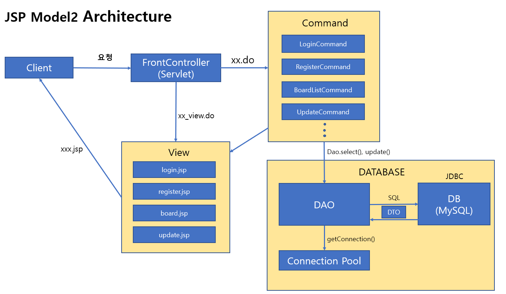

# JSP-Model2

## 동영상 시연

## 전체적인 아키텍쳐

#### Front Controller

프론트 컨트롤러는 클라이언트의 요청을 전부 받아 Command를 수행하는 Servlet 입니다. 클라이언트의 요청이 `xx_view.do` 인 경우에는 Forward를 통해 jsp 파일을 응답하고 `xx.do`인 경우에는 해당하는 `Command` 객체의 `execute()` 명령을 수행합니다.

#### Command

`Command`는 인터페이스로 정의되어있으며, 각 기능단위로 클래스를 정의하여 `Command`를 `implement` 하고 있습니다. 따라서 FrontController에서는 단순히 `execute` 메서드만 호출함으로써 원하는 비즈니스 로직을 수행할 수 있습니다.

`Command`는 DB에 접근할 필요가 있을 경우, DAO 객체를 생성하여 DAO를 통해 Database에 질의합니다. 비즈니스 로직이 끝난 후에는 `View page`를 클라이언트에게 포워딩하여 넘겨줍니다.

#### DAO

`DAO`는 `DataSource` 라는 객체로부터 Connection 객체를 얻어오는 방식인 `Connection Pool`을 사용합니다. `DAO`에서 중복되는 부분은 `DBManager`라는 별도의 클래스에서 처리할 수 있도록 정의해두었습니다. `DBMangaer`는 `DAO`가 자신의 기능에만 충실할 수 있게끔 `connection`과 `close` 기능을 제공하고 있습니다.

#### View

뷰 페이지에서는 중복되는 부분을 `navBar.jsp` `base.jsp` 등으로 정의하고 나머지 jsp파일에서 이들을 include 하는 방식을 취하고 있습니다. `session`의 유무에 따라 화면에 보여지는 UI가 달라져야 하는 경우에는 `JSTL(JSP Standard Tag Library)`를 이용하여 제어했습니다. 

